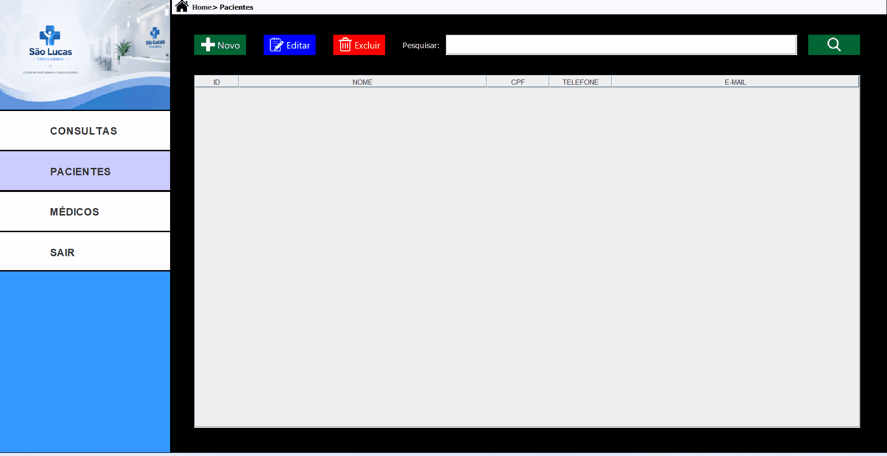
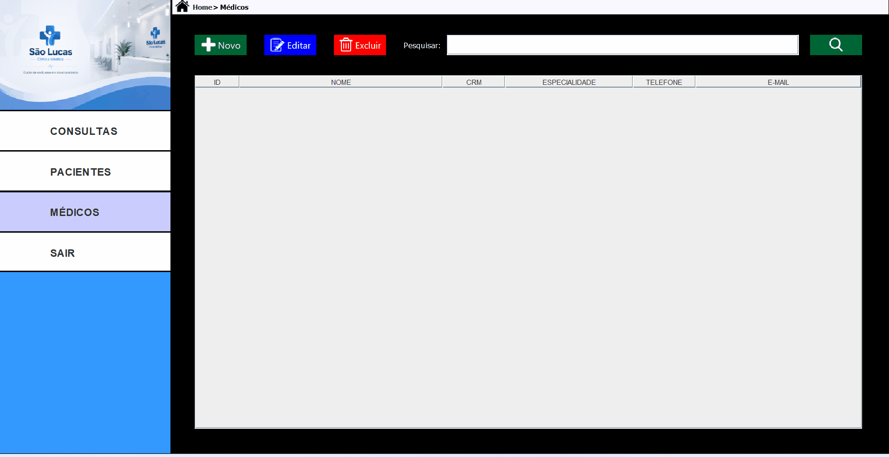
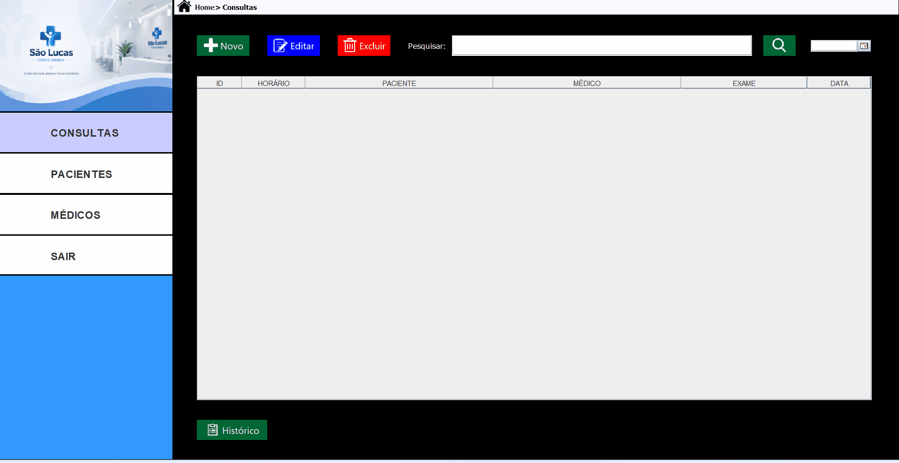

# 🏥 Clínica São Lucas

Sistema desktop para gerenciamento de uma clínica médica, desenvolvido em
Java Swing com integração ao banco de dados PostgreSQL.

O projeto foi desenvolvido com foco em organização do código, separação de
responsabilidades, segurança, validação de dados e gerenciamento eficiente
das conexões com o banco de dados.

---

## 📌 Sobre o projeto

O sistema **Clínica São Lucas** é uma aplicação desktop desenvolvida em Java para
auxiliar no gerenciamento das principais operações de uma clínica médica.

O sistema permite o gerenciamento de:

- Usuários
- Pacientes
- Médicos
- Consultas
- Histórico de consultas

A aplicação possui uma interface gráfica desenvolvida com **Java Swing** e
utiliza **PostgreSQL** como banco de dados.

O acesso ao banco de dados é realizado através de **JDBC**, utilizando
**HikariCP** para gerenciamento do pool de conexões.

---

# 🎯 Funcionalidades

## 🔐 Autenticação e usuários

- Tela de login
- Validação de usuário e senha
- Cadastro de novos usuários
- Senha de autorização para cadastro
- Validação de campos obrigatórios
- Proteção das informações sensíveis através de criptografia


---

## 👤 Gerenciamento de pacientes

- Cadastro de pacientes
- Edição de pacientes
- Exclusão de pacientes
- Pesquisa de pacientes por nome
- Exibição dos pacientes em JTable
- Validação de CPF
- Validação de telefone
- Validação de e-mail
- Validação de campos obrigatórios
- Impedimento de exclusão de paciente que possui consulta cadastrada



---

## 👨‍⚕️ Gerenciamento de médicos

- Cadastro de médicos
- Edição de médicos
- Exclusão de médicos
- Pesquisa de médicos por nome
- Exibição dos médicos em JTable
- Validação de telefone
- Validação de e-mail
- Validação de campos obrigatórios
- Impedimento de exclusão de médico que possui consulta cadastrada



---

## 📅 Gerenciamento de consultas

- Cadastro de consultas
- Edição de consultas
- Exclusão de consultas
- Pesquisa por nome
- Pesquisa por data
- Associação entre paciente e médico
- Exibição das consultas em JTable



---

## 📋 Histórico de consultas

- Visualização do histórico de consultas
- Pesquisa por nome
- Pesquisa por data
- Exclusão de registros
- Exibição dos dados através de JTable


---

# 🛠️ Tecnologias utilizadas

- **Java**
- **Java Swing**
- **JDBC**
- **PostgreSQL**
- **HikariCP**
- **Criptografia AES**
- **Caelum Stella**
- **Google libphonenumber**
- **NetBeans**

---

# 🏗️ Arquitetura

O projeto foi organizado em camadas para separar as responsabilidades da
aplicação.

```text
┌──────────────────────────┐
│          VIEW            │
│     Interface gráfica    │
│        Java Swing        │
└────────────┬─────────────┘
             │
             ▼
┌──────────────────────────┐
│         SERVICE          │
│     Regras de negócio    │
└────────────┬─────────────┘
             │
             ▼
┌──────────────────────────┐
│           DAO            │
│     Acesso aos dados     │
└────────────┬─────────────┘
             │
             ▼
┌──────────────────────────┐
│         HIKARICP         │
│   Pool de conexões JDBC  │
└────────────┬─────────────┘
             │
             ▼
┌──────────────────────────┐
│        POSTGRESQL        │
│       Banco de dados     │
└──────────────────────────┘
